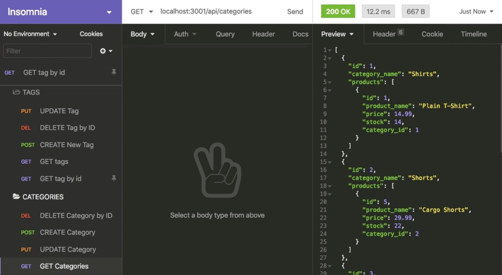

# E-commerce Back End :credit_card:

This application is an e-commerce backend site. An Express.js API was configured for it to use Sequelize and then interact with a MySQL database.

## **Steps to get started:**
```
- npm i (+ dependencies)
- npm run seed
- node server.js
```

## **Application Acceptance Criteria:**


## **Mock Up:**


## **Technology used:**
```
- Javascript
- Node.js
- Express.js
- MySQL2
- Sequelize
- Dotenv
```
